## Top 1

### 肖申克的救赎 / The Shawshank Redemption / 月黑高飞(港)  /  刺激1995(台)
* 导演: 弗兰克·德拉邦特 Frank Darabont   主演: 蒂姆·罗宾斯 Tim Robbins /...
* 1994 / 美国 / 犯罪 剧情
* **9.6** 796310人评价

> 希望让人自由。

***

## Top 2

### 这个杀手不太冷 / Léon / 杀手莱昂  /  终极追杀令(台)
* 导演: 吕克·贝松 Luc Besson   主演: 让·雷诺 Jean Reno / 娜塔丽·波特曼 ...
* 1994 / 法国 / 剧情 动作 犯罪
* **9.4** 764531人评价

> 怪蜀黍和小萝莉不得不说的故事。

***

## Top 3

### 霸王别姬 / 再见，我的妾  /  Farewell My Concubine
* 导演: 陈凯歌 Kaige Chen   主演: 张国荣 Leslie Cheung / 张丰毅 Fengyi Zha...
* 1993 / 中国大陆 香港 / 剧情 爱情 同性
* **9.5** 561984人评价

> 风华绝代。

***

## Top 4

### 阿甘正传 / Forrest Gump / 福雷斯特·冈普
* 导演: Robert Zemeckis   主演: Tom Hanks / Robin Wright Penn / Gary Sinise
* 1994 / 美国 / 剧情 爱情
* **9.4** 658363人评价

> 一部美国近现代史。

***

## Top 5

### 美丽人生 / La vita è bella / 一个快乐的传说(港)  /  Life Is Beautiful
* 导演: 罗伯托·贝尼尼 Roberto Benigni   主演: 罗伯托·贝尼尼 Roberto Beni...
* 1997 / 意大利 / 剧情 喜剧 爱情 战争
* **9.5** 380155人评价

> 最美的谎言。

***

## Top 6

### 千与千寻 / 千と千尋の神隠し / 神隐少女(台)  /  Spirited Away
* 导演: 宫崎骏 Hayao Miyazaki   主演: 柊瑠美 Rumi Hîragi / 入野自由 Miy...
* 2001 / 日本 / 剧情 动画 奇幻
* **9.2** 610346人评价

> 最好的宫崎骏，最好的久石让。 

***

## Top 7

### 辛德勒的名单 / Schindler's List / 舒特拉的名单(港)  /  辛德勒名单
* 导演: 史蒂文·斯皮尔伯格 Steven Spielberg   主演: 连姆·尼森 Liam Neeson...
* 1993 / 美国 / 剧情 历史 战争
* **9.4** 352404人评价

> 拯救一个人，就是拯救整个世界。

***

## Top 8

### 泰坦尼克号 / Titanic / 铁达尼号(港 / 台)
* 导演: 詹姆斯·卡梅隆 James Cameron   主演: 莱昂纳多·迪卡普里奥 Leonardo...
* 1997 / 美国 / 剧情 爱情 灾难
* **9.2** 605284人评价

> 失去的才是永恒的。 

***

## Top 9

### 盗梦空间 / Inception / 潜行凶间(港)  /  全面启动(台)
* 导演: 克里斯托弗·诺兰 Christopher Nolan   主演: 莱昂纳多·迪卡普里奥 Le...
* 2010 / 美国 英国 / 剧情 动作 科幻 悬疑 冒险
* **9.2** 714197人评价

> 诺兰给了我们一场无法盗取的梦。

***

## Top 10

### 机器人总动员 / WALL·E / 瓦力(台)  /  太空奇兵·威E(港)
* 导演: 安德鲁·斯坦顿 Andrew Stanton   主演: 本·贝尔特 Ben Burtt / 艾丽...
* 2008 / 美国 / 喜剧 爱情 科幻 动画 冒险
* **9.3** 469100人评价

> 小瓦力，大人生。

***

## Top 11

### 海上钢琴师 / La leggenda del pianista sull'oceano / 声光伴我飞(台)  /  一九零零的传奇(港)
* 导演: 朱塞佩·托纳多雷 Giuseppe Tornatore   主演: 蒂姆·罗斯 Tim Roth / ...
* 1998 / 意大利 / 剧情 音乐
* **9.2** 561778人评价

> 每个人都要走一条自己坚定了的路，就算是粉身碎骨。 

***

## Top 12

### 三傻大闹宝莱坞 / 3 Idiots / 三个傻瓜(台)  /  作死不离3兄弟(港)
* 导演: 拉库马·希拉尼 Rajkumar Hirani   主演: 阿米尔·汗 Aamir Khan / 卡...
* 2009 / 印度 / 剧情 喜剧 爱情 歌舞
* **9.1** 619101人评价

> 英俊版憨豆，高情商版谢耳朵。

***

## Top 13

### 忠犬八公的故事 / Hachi: A Dog's Tale / 忠犬小八(台)  /  秋田犬八千(港)
* 导演: 莱塞·霍尔斯道姆 Lasse Hallström   主演: 理查·基尔 Richard Ger...
* 2009 / 美国 英国 / 剧情
* **9.2** 411936人评价

> 永远都不能忘记你所爱的人。

***

## Top 14

### 放牛班的春天 / Les choristes / 歌声伴我心(港)  /  唱诗班男孩
* 导演: 克里斯托夫·巴拉蒂 Christophe Barratier   主演: 杰拉尔·朱诺 Géra...
* 2004 / 法国 瑞士 德国 / 剧情 音乐
* **9.2** 418989人评价

> 天籁一般的童声，是最接近上帝的存在。 

***

## Top 15

### 大话西游之大圣娶亲 / 西遊記大結局之仙履奇緣 / 西游记完结篇仙履奇缘  /  齐天大圣西游记
* 导演: 刘镇伟 Jeffrey Lau   主演: 周星驰 Stephen Chow / 吴孟达 Man Tat Ng...
* 1995 / 香港 中国大陆 / 动作 冒险 喜剧 奇幻 爱情
* **9.1** 426242人评价

> 一生所爱。

***

## Top 16

### 教父 / The Godfather / Mario Puzo's The Godfather
* 导演: 弗朗西斯·福特·科波拉 Francis Ford Coppola   主演: 马龙·白兰度 M...
* 1972 / 美国 / 剧情 犯罪
* **9.2** 320082人评价

> 千万不要记恨你的对手，这样会让你失去理智。

***

## Top 17

### 龙猫 / となりのトトロ / 邻家的豆豆龙  /  隔壁的特特罗
* 导演: 宫崎骏 Hayao Miyazaki   主演: 日高法子 Noriko Hidaka / 坂本千夏 Ch...
* 1988 / 日本 / 动画 奇幻
* **9.1** 389667人评价

> 人人心中都有个龙猫，童年就永远不会消失。

***

## Top 18

### 乱世佳人 / Gone with the Wind / 飘
* 导演: Victor Fleming / George Cukor   主演: 克拉克·盖博 Clark Gable / ...
* 1939 / 美国 / 剧情 爱情 战争
* **9.2** 252639人评价

> Tomorrow is another day.

***

## Top 19

### 楚门的世界 / The Truman Show / 真人Show(港)  /  真人戏
* 导演: 彼得·威尔 Peter Weir   主演: 金·凯瑞 Jim Carrey / 劳拉·琳妮 Lau...
* 1998 / 美国 / 剧情 科幻
* **9.0** 411942人评价

> 如果再也不能见到你，祝你早安，午安，晚安。

***

## Top 20

### 天堂电影院 / Nuovo Cinema Paradiso / 星光伴我心(港)  /  新天堂乐园(台)
* 导演: 朱塞佩·托纳多雷 Giuseppe Tornatore   主演: 安东娜拉·塔莉 Antonel...
* 1988 / 意大利 法国 / 剧情 爱情
* **9.1** 290360人评价

> 那些吻戏，那些青春，都在影院的黑暗里被泪水冲刷得无比清晰。

***

## Top 21

### 当幸福来敲门 / The Pursuit of Happyness / 寻找快乐的故事(港)  /  追求快乐
* 导演: 加布里尔·穆奇诺 Gabriele Muccino   主演: 威尔·史密斯 Will Smith ...
* 2006 / 美国 / 剧情 传记 家庭
* **8.9** 503231人评价

> 平民励志片。 

***

## Top 22
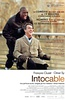
### 触不可及 / Intouchables / 闪亮人生(港)  /  逆转人生(台)
* 导演: 奥利维·那卡什 Olivier Nakache / 艾力克·托兰达 Eric Toledano   主...
* 2011 / 法国 / 剧情 喜剧
* **9.1** 339300人评价

> 满满温情的高雅喜剧。

***

## Top 23

### 搏击俱乐部 / Fight Club / 搏击会(港)  /  斗阵俱乐部(台)
* 导演: 大卫·芬奇 David Fincher   主演: 爱德华·诺顿 Edward Norton / 布拉...
* 1999 / 美国 德国 / 剧情 动作 悬疑 惊悚
* **9.0** 382881人评价

> 邪恶与平庸蛰伏于同一个母体，在特定的时间互相对峙。

***

## Top 24

### 十二怒汉 / 12 Angry Men / 12怒汉  /  十二怒汉
* 导演: Sidney Lumet   主演: 亨利·方达 Henry Fonda / 马丁·鲍尔萨姆 Marti...
* 1957 / 美国 / 剧情
* **9.3** 157374人评价

> 1957年的理想主义。 

***

## Top 25

### 指环王3：王者无敌 / The Lord of the Rings: The Return of the King / 魔戒三部曲：王者再临(台 / 港) 
* 导演: 彼得·杰克逊 Peter Jackson   主演: 维果·莫腾森 Viggo Mortensen / ...
* 2003 / 美国 新西兰 / 剧情 动作 奇幻 冒险
* **9.1** 267866人评价

> 史诗的终章。

***

## Top 26

### 无间道 / 無間道 / Infernal Affairs
* 导演: 刘伟强 / 麦兆辉   主演: 刘德华 / 梁朝伟 / 黄秋生
* 2002 / 香港 / 犯罪 悬疑 惊悚
* **9.0** 366432人评价

> 香港电影史上永不过时的杰作。

***

## Top 27

### 怦然心动 / Flipped / 萌动青春  /  青春萌动
* 导演: 罗伯·莱纳 Rob Reiner   主演: 玛德琳·卡罗尔 Madeline Carroll / 卡...
* 2010 / 美国 / 剧情 喜剧 爱情
* **8.9** 498035人评价

> 真正的幸福是来自内心深处。

***

## Top 28

### 熔炉 / 도가니 / 无声呐喊(港)  /  漩涡
* 导演: 黄东赫 Dong-hyuk Hwang   主演: 孔侑 Yoo Gong / 郑有美 Yu-mi Jeong ...
* 2011 / 韩国 / 剧情
* **9.2** 217926人评价

> 我们一路奋战不是为了改变世界，而是为了不让世界改变我们。

***

## Top 29

### 罗马假日 / Roman Holiday / 金枝玉叶(港)  /  罗马假期(台)
* 导演: 威廉·惠勒 William Wyler   主演: 奥黛丽·赫本 Audrey Hepburn / 格...
* 1953 / 美国 / 喜剧 剧情 爱情
* **8.9** 360131人评价

> 爱情哪怕只有一天。

***

## Top 30

### 天空之城 / 天空の城ラピュタ / Tenkû no shiro Rapyuta  /  Laputa: Castle in the Sky
* 导演: 宫崎骏 Hayao Miyazaki   主演: 田中真弓 Mayumi Tanaka / 鹫尾真知子 ...
* 1986 / 日本 / 动画 奇幻 冒险
* **9.0** 308680人评价

> 对天空的追逐，永不停止。 

***

## Top 31

### 少年派的奇幻漂流 / Life of Pi / 少年Pi的奇幻漂流  /  漂流少年Pi
* 导演: 李安 Ang Lee   主演: 苏拉·沙玛 Suraj Sharma / 拉菲·斯波 Rafe Spa...
* 2012 / 美国 台湾 英国 加拿大 / 剧情 奇幻 冒险
* **9.0** 545210人评价

> 瑰丽壮观、无人能及的冒险之旅。

***

## Top 32

### 大话西游之月光宝盒 / 西遊記第壹佰零壹回之月光寶盒 / 西游记101回月光宝盒  /  齐天大圣东游记
* 导演: 刘镇伟 Jeffrey Lau   主演: 周星驰 Stephen Chow / 吴孟达 Man Tat Ng...
* 1995 / 香港 中国大陆 / 喜剧 动作 爱情 奇幻 冒险 古装
* **8.9** 364322人评价

> 旷古烁今。

***

## Top 33

### 鬼子来了 / Devils on the Doorstep
* 导演: 姜文 Wen Jiang   主演: 姜文 Wen Jiang / 香川照之 Teruyuki Kagawa /...
* 2000 / 中国大陆 / 剧情 战争
* **9.1** 208659人评价

> 对敌人的仁慈，就是对自己残忍。

***

## Top 34

### 两杆大烟枪 / Lock, Stock and Two Smoking Barrels / 够姜四小强(港)  /  两根枪管(台)
* 导演: Guy Ritchie   主演: Jason Flemyng / Dexter Fletcher / Nick Moran
* 1998 / 英国 / 剧情 喜剧 犯罪
* **9.0** 256871人评价

> 4个臭皮匠顶个诸葛亮，盖·里奇果然不是盖的。

***

## Top 35
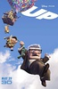
### 飞屋环游记 / Up / 冲天救兵(港)  /  天外奇迹(台)
* 导演: 彼特·道格特 Pete Docter   主演: 爱德华·阿斯纳 Edward Asner / 克...
* 2009 / 美国 / 剧情 喜剧 动画 奇幻 冒险
* **8.9** 469132人评价

> 最后那些最无聊的事情，才是最值得怀念的。 

***

## Top 36

### 蝙蝠侠：黑暗骑士 / The Dark Knight / 蝙蝠侠前传2：黑暗骑士  /  黑暗骑士(台)
* 导演: 克里斯托弗·诺兰 Christopher Nolan   主演: 克里斯蒂安·贝尔 Christ...
* 2008 / 美国 英国 / 剧情 动作 科幻 犯罪 惊悚
* **9.0** 292165人评价

> 无尽的黑暗。

***

## Top 37

### 飞越疯人院 / One Flew Over the Cuckoo's Nest / 飞越杜鹃窝  /  飞越喜鹊巢
* 导演: 米洛斯·福尔曼 Miloš Forman   主演: 杰克·尼科尔森 Jack Nichols...
* 1975 / 美国 / 剧情
* **9.0** 260011人评价

> 自由万岁。

***

## Top 38

### 窃听风暴 / Das Leben der Anderen / 他人的生活  /  别人的生活
* 导演: 弗洛里安·亨克尔·冯·多纳斯马 Florian Henckel von Donnersmarck   ...
* 2006 / 德国 / 剧情 悬疑
* **9.1** 204115人评价

> 别样人生。

***

## Top 39

### 星际穿越 / Interstellar / 星际启示录(港)  /  星际效应(台)
* 导演: 克里斯托弗·诺兰 Christopher Nolan   主演: 马修·麦康纳 Matthew Mc...
* 2014 / 美国 英国 加拿大 / 剧情 科幻 悬疑 冒险 家庭
* **9.1** 443646人评价

> 爱是一种力量，让我们超越时空感知它的存在。

***

## Top 40

### 活着 / 人生  /  Lifetimes
* 导演: 张艺谋 Yimou Zhang   主演: 葛优 You Ge / 巩俐 Li Gong / 姜武 Wu Jiang
* 1994 / 中国大陆 香港 / 剧情 家庭
* **9.0** 239982人评价

> 张艺谋最好的电影。

***

## Top 41

### 海豚湾 / The Cove / 血色海湾(台)  /  海湾
* 导演: Louie Psihoyos   主演: John Chisholm / Mandy-Rae Cruikshank / Char...
* 2009 / 美国 / 纪录片
* **9.3** 172587人评价

> 海豚的微笑，是世界上最高明的伪装。

***

## Top 42

### 闻香识女人 / Scent of a Woman / 女人香  /  女人的芳香
* 导演: 马丁·布莱斯 Martin Brest   主演: 阿尔·帕西诺 Al Pacino / 克里斯...
* 1992 / 美国 / 剧情
* **8.9** 297110人评价

> 史上最美的探戈。

***

## Top 43

### V字仇杀队 / V for Vendetta / V煞(港)  /  V怪客(台)
* 导演: 詹姆斯·麦克特格 James McTeigue   主演: 娜塔丽·波曼 Natalie Portm...
* 2005 / 美国 英国 德国 / 剧情 动作 科幻 惊悚
* **8.8** 382006人评价

> 一张面具背后的理想与革命。

***

## Top 44

### 美丽心灵 / A Beautiful Mind / 有你终生美丽(港)  /  美丽境界(台)
* 导演: 朗·霍华德 Ron Howard   主演: 罗素·克劳 Russell Crowe / 詹妮弗·...
* 2001 / 美国 / 传记 剧情
* **8.9** 284204人评价

> 爱是一切逻辑和原由。

***

## Top 45

### 教父2 / The Godfather: Part Ⅱ / 教父续集  /  教父II
* 导演: 弗朗西斯·福特·科波拉 Francis Ford Coppola   主演: 阿尔·帕西诺 A...
* 1974 / 美国 / 剧情 犯罪
* **9.1** 172750人评价

> 优雅的孤独。

***

## Top 46

### 指环王2：双塔奇兵 / The Lord of the Rings: The Two Towers / 魔戒二部曲：双城奇谋  /  指环王II：双塔
* 导演: 彼得·杰克逊 Peter Jackson   主演: 伊利亚·伍德 Elijah Wood / 西恩...
* 2002 / 美国 新西兰 / 剧情 动作 奇幻 冒险
* **8.9** 253457人评价

> 承前启后的史诗篇章。

***

## Top 47

### 指环王1：魔戒再现 / The Lord of the Rings: The Fellowship of the Ring / 魔戒首部曲：魔戒现身  /  指环王I：护戒使者
* 导演: 彼得·杰克逊 Peter Jackson   主演: 伊利亚·伍德 Elijah Wood / 西恩...
* 2001 / 新西兰 美国 / 剧情 动作 奇幻 冒险
* **8.9** 282579人评价

> 传说的开始。

***

## Top 48

### 哈尔的移动城堡 / ハウルの動く城 / 呼啸山城  /  霍尔的移动城堡
* 导演: 宫崎骏 Hayao Miyazaki   主演: 倍赏千惠子 Chieko Baishô / 木村拓...
* 2004 / 日本 / 爱情 动画 奇幻 冒险
* **8.8** 319125人评价

> 带着心爱的人在天空飞翔。

***

## Top 49

### 天使爱美丽 / Le fabuleux destin d'Amélie Poulain / 艾蜜莉的异想世界(台)  /  天使艾米莉
* 导演: Jean-Pierre Jeunet   主演: 奥黛丽·塔图 Audrey Tautou / 马修·卡索...
* 2001 / 法国 德国 / 喜剧 爱情
* **8.7** 452506人评价

> 法式小清新。 

***

## Top 50

### 情书 / Love Letter / When I Close My Eyes  /  Letters of Love
* 导演: 岩井俊二 Shunji Iwai   主演: 中山美穗 Miho Nakayama / 丰川悦司 Ets...
* 1995 / 日本 / 剧情 爱情
* **8.8** 343981人评价

> 暗恋的极致。

***

## Top 51

### 死亡诗社 / Dead Poets Society / 暴雨骄阳(港)  /  春风化雨(台)
* 导演: 彼得·威尔 Peter Weir   主演: 罗宾·威廉姆斯 Robin Williams / 罗伯...
* 1989 / 美国 / 剧情
* **8.9** 253143人评价

> 当一个死水般的体制内出现一个活跃的变数时，所有的腐臭都站在了光明的对面。

***

## Top 52

### 美国往事 / Once Upon a Time in America / 四海兄弟(台)  /  义薄云天(港)
* 导演: Sergio Leone   主演: 罗伯特·德尼罗 Robert De Niro / 詹姆斯·伍兹 ...
* 1984 / 意大利 美国 / 犯罪 剧情
* **9.1** 160907人评价

> 往事如烟，无处祭奠。

***

## Top 53

### 七宗罪 / Se7en / 火线追缉令  /  7宗罪
* 导演: 大卫·芬奇 David Fincher   主演: 摩根·弗里曼 Morgan Freeman / 布...
* 1995 / 美国 / 剧情 犯罪 悬疑 惊悚
* **8.7** 407253人评价

> 警察抓小偷，老鼠玩死猫。

***

## Top 54

### 钢琴家 / The Pianist / 战地琴人  /  钢琴战曲
* 导演: 罗曼·波兰斯基 Roman Polanski   主演: 艾德里安·布洛迪 Adrien Brod...
* 2002 / 法国 德国 英国 波兰 / 剧情 传记 历史 战争
* **9.0** 188038人评价

> 音乐能化解仇恨。

***

## Top 55

### 狮子王 / The Lion King / 狮子王3D
* 导演: Roger Allers / 罗伯·明可夫 Rob Minkoff   主演: 乔纳森·泰勒·托马...
* 1994 / 美国 / 剧情 动画 冒险 歌舞 家庭
* **8.9** 260986人评价

> 动物版《哈姆雷特》。

***

## Top 56

### 勇敢的心 / Braveheart / 惊世未了缘(港)  /  梅尔吉勃逊之英雄本色(台)
* 导演: 梅尔·吉布森 Mel Gibson   主演: 梅尔·吉布森 Mel Gibson / 苏菲·玛...
* 1995 / 美国 / 动作 传记 剧情 历史 战争
* **8.8** 278346人评价

> 史诗大片的典范。

***

## Top 57

### 致命魔术 / The Prestige / 顶尖对决(台)  /  死亡魔法(港)
* 导演: 克里斯托弗·诺兰 Christopher Nolan   主演: 克里斯蒂安·贝尔 Christ...
* 2006 / 美国 英国 / 剧情 悬疑 惊悚
* **8.8** 313361人评价

> 孪生蝙蝠侠大战克隆金刚狼。

***

## Top 58

### 被嫌弃的松子的一生 / 嫌われ松子の一生 / 花样奇缘(港)  /  令人讨厌的松子的一生(台)
* 导演: 中岛哲也 Tetsuya Nakashima   主演: 中谷美纪 Miki Nakatani / 瑛太 E...
* 2006 / 日本 / 剧情 歌舞
* **8.9** 250339人评价

> 以戏谑来戏谑戏谑。

***

## Top 59

### 剪刀手爱德华 / Edward Scissorhands / 幻海奇缘(港)  /  剪刀手爱德华
* 导演: Tim Burton   主演: 约翰尼·德普 Johnny Depp / 薇诺娜·瑞德 Winona ...
* 1990 / 美国 / 剧情 奇幻 爱情
* **8.7** 450733人评价

> 浪漫忧郁的成人童话。

***

## Top 60

### 辩护人 / 변호인 / 逆权大状(港)  /  正义辩护人(台)
* 导演: 杨宇硕 Woo-seok Yang   主演: 宋康昊 Kang-ho Song / 吴达洙 Dal-su O...
* 2013 / 韩国 / 剧情
* **9.1** 176897人评价

> 电影的现实意义大过电影本身。

***

## Top 61

### 音乐之声 / The Sound of Music / 仙乐飘飘处处闻(港)  /  真善美(台)
* 导演: Robert Wise   主演: 朱丽·安德鲁斯 Julie Andrews / 克里斯托弗·普...
* 1965 / 美国 / 剧情 爱情 歌舞 家庭 传记
* **8.9** 215441人评价

> 用音乐化解仇恨，让歌声串起美好。

***

## Top 62

### 小鞋子 / بچههای آسمان / 天堂的孩子  /  小童鞋
* 导演: 马基德·马基迪 Majid Majidi   主演: Amir Farrokh Hashemian / 默罕...
* 1999 / 伊朗 / 剧情 家庭 儿童
* **9.1** 123323人评价

> 奔跑的孩子是天使。

***

## Top 63
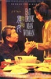
### 饮食男女 / 飲食男女 / Eat Drink Man Woman
* 导演: 李安 Ang Lee   主演: 吴倩莲 Chien-lien Wu / 杨贵媚 Kuei-Mei Yang /...
* 1994 / 台湾 美国 / 剧情 家庭
* **9.0** 168761人评价

> 人生不能像做菜，把所有的料都准备好了才下锅。

***

## Top 64

### 控方证人 / Witness for the Prosecution / 雄才伟略  /  情妇
* 导演: 比利·怀尔德 Billy Wilder   主演: 查尔斯·劳顿 Charles Laughton / ...
* 1957 / 美国 / 剧情 犯罪 悬疑
* **9.6** 67254人评价

> 比利·怀德满分作品。

***

## Top 65

### 低俗小说 / Pulp Fiction / 黑色追緝令(台)  /  危险人物(港)
* 导演: 昆汀·塔伦蒂诺 Quentin Tarantino   主演: 约翰·特拉沃尔塔 John Tra...
* 1994 / 美国 / 剧情 喜剧 犯罪
* **8.7** 304569人评价

> 故事的高级讲法。

***

## Top 66

### 入殓师 / おくりびと / 礼仪师之奏鸣曲(港)  /  礼仪师(台)
* 导演: 泷田洋二郎 Yôjirô Takita   主演: 本木雅弘 Masahiro Motoki / ...
* 2008 / 日本 / 剧情
* **8.8** 298989人评价

> 死可能是一道门，逝去并不是终结，而是超越，走向下一程。

***

## Top 67

### 沉默的羔羊 / The Silence of the Lambs / 沉默的羔羊
* 导演: Jonathan Demme   主演: Jodie Foster / Anthony Hopkins / Scott Glenn
* 1991 / 美国 / 剧情 犯罪 惊悚
* **8.7** 322839人评价

> 安东尼·霍普金斯的顶级表演。

***

## Top 68

### 本杰明·巴顿奇事 / The Curious Case of Benjamin Button / 奇幻逆缘(港)  /  返老还童
* 导演: 大卫·芬奇 David Fincher   主演: 凯特·布兰切特 Cate Blanchett / ...
* 2008 / 美国 / 剧情 爱情 奇幻
* **8.7** 365974人评价

> 在时间之河里感受溺水之苦。

***

## Top 69

### 蝴蝶效应 / The Butterfly Effect / 蝴蝶效应
* 导演: 埃里克·布雷斯 Eric Bress / J·麦基·格鲁伯 J. Mackye Gruber   主...
* 2004 / 美国 加拿大 / 剧情 悬疑 科幻 惊悚
* **8.7** 353778人评价

> 人的命运被自己瞬间的抉择改变。

***

## Top 70

### 黑客帝国 / The Matrix / 廿二世纪杀人网络(港)  /  骇客任务(台)
* 导演: 安迪·沃卓斯基 Andy Wachowski / 拉娜·沃卓斯基 Lana Wachowski   主...
* 1999 / 美国 澳大利亚 / 动作 科幻
* **8.8** 256445人评价

> 视觉革命。

***

## Top 71

### 拯救大兵瑞恩 / Saving Private Ryan / 雷霆救兵(港)  /  抢救雷恩大兵(台)
* 导演: 史蒂文·斯皮尔伯格 Steven Spielberg   主演: 汤姆·汉克斯 Tom Hanks...
* 1998 / 美国 / 剧情 历史 战争
* **8.8** 215019人评价

> 美利坚精神输出大片No1.

***

## Top 72

### 玛丽和马克思 / Mary and Max / 巧克力情缘  /  玛丽和麦克斯
* 导演: Adam Elliot   主演: 托妮·科莱特 Toni Collette / 菲利普·塞默·霍...
* 2009 / 澳大利亚 / 剧情 爱情 动画
* **8.9** 220391人评价

> 你是我最好的朋友，你是我唯一的朋友 。

***

## Top 73
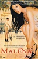
### 西西里的美丽传说 / Malèna / 真爱伴我行(台)  /  玛莲娜
* 导演: 朱塞佩·托纳多雷 Giuseppe Tornatore   主演: 莫妮卡·贝鲁奇 Monica ...
* 2000 / 意大利 美国 / 剧情 战争 情色
* **8.7** 312373人评价

> 美丽无罪。

***

## Top 74

### 素媛 / 소원 / 许愿  /  希望：为爱重生(台)
* 导演: 李濬益 Jun-ik Lee   主演: 薛景求 Kyung-gu Sol / 严志媛 Ji-won Uhm ...
* 2013 / 韩国 / 剧情 家庭
* **9.1** 151879人评价

> 受过伤害的人总是笑得最开心，因为他们不愿意让身边的人承受一样的痛苦。

***

## Top 75

### 心灵捕手 / Good Will Hunting / 骄阳似我(港)  /  心灵捕手
* 导演: 格斯·范·桑特 Gus Van Sant   主演: 马特·达蒙 Matt Damon / 罗宾·...
* 1997 / 美国 / 剧情
* **8.7** 244482人评价

> 人生中应该拥有这样的一段豁然开朗。

***

## Top 76

### 幽灵公主 / もののけ姫 / 魔法公主  /  幽灵少女
* 导演: 宫崎骏   主演: 松田洋治 / 石田百合子 / 田中裕子
* 1997 / 日本 / 动画 冒险 奇幻
* **8.8** 215540人评价

> 人与自然的战争史诗。

***

## Top 77

### 第六感 / The Sixth Sense / 灵异第六感  /  鬼眼
* 导演: M·奈特·沙马兰 M. Night Shyamalan   主演: 布鲁斯·威利斯 Bruce Wi...
* 1999 / 美国 / 剧情 悬疑 恐怖
* **8.8** 213267人评价

> 深入内心的恐怖，出人意料的结局。

***

## Top 78

### 阳光灿烂的日子 / In the Heat of the Sun
* 导演: 姜文 Wen Jiang   主演: 夏雨 Yu Xia / 宁静 Jing Ning / 陶虹 Hong Tao
* 1994 / 中国大陆 香港 / 剧情
* **8.7** 247624人评价

> 一场华丽的意淫。

***

## Top 79

### 让子弹飞 / 让子弹飞一会儿  /  火烧云
* 导演: 姜文 Wen Jiang   主演: 姜文 Wen Jiang / 葛优 You Ge / 周润发 Yun-F...
* 2010 / 中国大陆 香港 / 剧情 喜剧 动作 西部
* **8.7** 580840人评价

> 你给我翻译翻译，神马叫做TMD的惊喜。

***

## Top 80
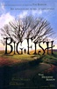
### 大鱼 / Big Fish / 大鱼奇缘(港)  /  大智若鱼(台)
* 导演: Tim Burton   主演: Ewan McGregor / Albert Finney / Billy Crudup
* 2003 / 美国 / 剧情 家庭 奇幻 冒险
* **8.7** 230333人评价

> 抱着梦想而活着的人是幸福的，怀抱梦想而死去的人是不朽的。

***

## Top 81

### 射雕英雄传之东成西就 / 射鵰英雄傳之東成西就 / 东成西就  /  大英雄 (日本)
* 导演: 刘镇伟 Jeffrey Lau   主演: 梁朝伟 Tony Leung Chiu Wai / 林青霞 Bri...
* 1993 / 香港 / 喜剧 古装
* **8.7** 251899人评价

> 百看不厌。 

***

## Top 82

### 春光乍泄 / 春光乍洩 / 一起快乐  /  Happy Together
* 导演: 王家卫   主演: 张国荣 / 梁朝伟 / 张震
* 1997 / 香港 日本 韩国 / 剧情 爱情 同性
* **8.7** 217396人评价

> 爱情纠缠，男女一致。

***

## Top 83

### 大闹天宫 / 大闹天宫 上下集  /  The Monkey King
* 导演: 万籁鸣 Laiming Wan / 唐澄 Cheng  Tang   主演: 邱岳峰 Yuefeng Qiu /...
* 1961(上集) / 1964(下集) / 1978(全本) / 2004(纪念版) / 中国大陆 / 动画 奇幻
* **9.2** 87273人评价

> 经典之作，历久弥新。

***

## Top 84

### 阳光姐妹淘 / 써니 / 阳光姊妹淘(港)  /  桑尼
* 导演: 姜炯哲 Hyeong-Cheol Kang   主演: 沈恩京 Eun-kyung Shim / 闵孝琳 Hy...
* 2011 / 韩国 / 剧情 喜剧
* **8.8** 245576人评价

> 再多各自牛逼的时光，也比不上一起傻逼的岁月。 

***

## Top 85

### 重庆森林 / 重慶森林 / Chungking Express
* 导演: 王家卫 Kar Wai Wong   主演: 林青霞 Brigitte Lin / 金城武 Takeshi K...
* 1994 / 香港 / 剧情 爱情
* **8.6** 293768人评价

> 寂寞没有期限。

***

## Top 86

### 上帝之城 / Cidade de Deus / 无主之城 (港)  /  无法无天 (台)
* 导演: Kátia Lund / Fernando Meirelles   主演: Alexandre Rodrigues / Lea...
* 2002 / 巴西 法国 / 犯罪 剧情
* **8.9** 146573人评价

> 被上帝抛弃了的上帝之城。

***

## Top 87

### 禁闭岛 / Shutter Island / 不赦岛(港)  /  隔离岛(台)
* 导演: Martin Scorsese   主演: 莱昂纳多·迪卡普里奥 Leonardo DiCaprio / ...
* 2010 / 美国 / 剧情 悬疑 惊悚
* **8.6** 325239人评价

> 昔日翩翩少年，今日大腹便便。

***

## Top 88

### 甜蜜蜜 / Comrades: Almost a Love Story
* 导演: 陈可辛 Peter Chan   主演: 黎明 Leon Lai / 张曼玉 Maggie Cheung / ...
* 1996 / 香港 / 剧情 爱情
* **8.7** 211609人评价

> 逢只要一瞬间，等待却像是一辈子。

***

## Top 89

### 致命ID / Identity / 杀人游戏  /  致命身份
* 导演: James Mangold   主演: John Cusack / Ray Liotta / Amanda Peet
* 2003 / 美国 / 剧情 悬疑 惊悚
* **8.6** 285952人评价

> 最不可能的那个人永远是最可能的。

***

## Top 90

### 告白 / 自白  /  母亲
* 导演: 中岛哲也 Tetsuya Nakashima   主演: 松隆子 Takako Matsu / 冈田将生 ...
* 2010 / 日本 / 剧情 惊悚
* **8.6** 310188人评价

> 没有一人完全善，也没有一人完全恶。

***

## Top 91

### 一一 / Yi yi  /  Yi yi: A One and a Two
* 导演: 杨德昌   主演: 吴念真 / 李凯莉 Kelly Lee / 金燕玲 Elaine Jin
* 2000 / 台湾 日本 / 剧情 爱情 家庭
* **8.9** 139341人评价

> 我们都曾经是一一。

***

## Top 92

### 加勒比海盗 / Pirates of the Caribbean: The Curse of the Black Pearl / 加勒比海盗1：黑珍珠号的诅咒  /  神鬼奇航：鬼盗船魔咒(台)
* 导演: 戈尔·维宾斯基 Gore Verbinski   主演: 约翰尼·德普 Johnny Depp / ...
* 2003 / 美国 / 动作 冒险 奇幻
* **8.6** 304666人评价

> 约翰尼·德普的独角戏。

***

## Top 93
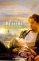
### 爱在黎明破晓前 / Before Sunrise / 情留半天(港)  /  爱在黎明破晓时(台)
* 导演: 理查德·林克莱特 Richard Linklater   主演: 伊桑·霍克 Ethan Hawke ...
* 1995 / 美国 奥地利 瑞士 / 剧情 爱情
* **8.7** 197515人评价

> 缘分是个连绵词，最美不过一瞬。

***

## Top 94

### 萤火虫之墓 / 火垂るの墓 / 再见萤火虫(港)  /  萤火挽歌
* 导演: 高畑勋 Isao Takahata   主演: 辰己努 / 白石绫乃 / 志乃原良子
* 1988 / 日本 / 动画 剧情 战争
* **8.7** 187475人评价

> 幸福是生生不息，却难以触及的远。 

***

## Top 95

### 阿凡达 / Avatar / 天神下凡  /  化身
* 导演: 詹姆斯·卡梅隆 James Cameron   主演: 萨姆·沃辛顿 Sam Worthington ...
* 2009 / 美国 英国 / 动作 冒险 奇幻 科幻
* **8.6** 490859人评价

> 绝对意义上的美轮美奂。

***

## Top 96

### 风之谷 / 風の谷のナウシカ / 风谷少女  /  Kaze no tani no Naushika
* 导演: 宫崎骏 Hayao Miyazaki   主演: 岛本须美 Sumi Shimamoto / 京田尚子 H...
* 1984 / 日本 / 科幻 动画 奇幻 冒险
* **8.8** 161029人评价

> 动画片的圣经。

***

## Top 97

### 布达佩斯大饭店 / The Grand Budapest Hotel / 布达佩斯大酒店(港)  /  欢迎来到布达佩斯大饭店(台)
* 导演: 韦斯·安德森 Wes Anderson   主演: 拉尔夫·费因斯 Ralph Fiennes / ...
* 2014 / 美国 德国 英国 / 剧情 喜剧
* **8.7** 274210人评价

> 小清新的故事里注入了大历史的情怀。

***

## Top 98

### 狩猎 / Jagten / 谎言的烙印(台)  /  诬网(港)
* 导演: 托马斯·温特伯格 Thomas Vinterberg   主演: 麦斯·米科尔森 Mads Mik...
* 2012 / 丹麦 瑞典 / 剧情
* **9.0** 106813人评价

> 人言可畏。

***

## Top 99

### 断背山 / Brokeback Mountain / 断臂山
* 导演: 李安 Ang Lee   主演: 希斯·莱杰 Heath Ledger / 杰克·吉伦哈尔 Jake...
* 2005 / 美国 加拿大 / 剧情 爱情 同性 家庭
* **8.6** 291765人评价

> 每个人心中都有一座断背山。

***

## Top 100

### 爱在日落黄昏时 / Before Sunset / 日落巴黎(港)  /  爱在日落巴黎时(台)
* 导演: 理查德·林克莱特 Richard Linklater   主演: 伊桑·霍克 Ethan Hawke ...
* 2004 / 美国 / 剧情 爱情
* **8.7** 181348人评价

> 九年后的重逢是世俗和责任的交叠，没了悸动和青涩，沧桑而温暖。

***

## Top 101

### 侧耳倾听 / 耳をすませば / 心之谷  /  梦幻街少女
* 导演: 近藤喜文 Yoshifumi Kondo   主演: 本名阳子 Youko Honna / 小林桂树 K...
* 1995 / 日本 / 剧情 爱情 动画 音乐
* **8.8** 151079人评价

> 少女情怀总是诗。

***

## Top 102

### 猫鼠游戏 / Catch Me If You Can / 逍遥法外  /  神鬼交锋(台)
* 导演: 史蒂文·斯皮尔伯格 Steven Spielberg   主演: 莱昂纳多·迪卡普里奥 L...
* 2002 / 美国 加拿大 / 传记 犯罪 剧情
* **8.7** 194861人评价

> 骗子大师和执著警探的你追我跑故事。 

***

## Top 103

### 摩登时代 / Modern Times / The Masses  /  Temps modernes, Les
* 导演: 查理·卓别林 Charles Chaplin   主演: 查理·卓别林 Charles Chaplin ...
* 1936 / 美国 / 喜剧 剧情 爱情
* **9.2** 76501人评价

> 大时代中的人生，小人物的悲喜。

***

## Top 104

### 驯龙高手 / How to Train Your Dragon / 驯龙记(港)
* 导演: 迪恩·德布洛斯 Dean DeBlois / 克里斯·桑德斯 Chris Sanders   主演:...
* 2010 / 美国 / 喜剧 动画 奇幻 冒险 家庭
* **8.7** 261066人评价

> 和谐的生活离不开摸头与被摸头。

***

## Top 105

### 海洋 / Océans / Oceans  /  海洋
* 导演: 雅克·贝汉 Jacques Perrin / 雅克·克鲁奥德 Jacques Cluzaud   主演:...
* 2009 / 法国 瑞士 西班牙 美国 阿联酋 / 纪录片
* **9.0** 93434人评价

> 大海啊，不全是水。

***

## Top 106

### 末代皇帝 / The Last Emperor / 末代皇帝溥仪(港)
* 导演: 贝纳尔多·贝托鲁奇 Bernardo Bertolucci   主演: 尊龙 John Lone / 陈...
* 1987 / 意大利 中国大陆 英国 法国 / 剧情 传记 历史
* **8.8** 141262人评价

> “不要跟我比惨，我比你更惨”再适合这部电影不过了。

***

## Top 107

### 超脱 / Detachment / 人间师格(台)
* 导演: 托尼·凯耶 Tony Kaye   主演: 艾德里安·布洛迪 Adrien Brody / 克里...
* 2011 / 美国 / 剧情
* **8.7** 154943人评价

> 穷尽一生，我们要学会的，不过是彼此拥抱。

***

## Top 108

### 哈利·波特与魔法石 / Harry Potter and the Sorcerer's Stone / 哈利波特1：神秘的魔法石(港 / 台) 
* 导演: Chris Columbus   主演: Daniel Radcliffe / Emma Watson / Rupert Grint
* 2001 / 美国 英国 / 奇幻 冒险
* **8.6** 221496人评价

> 童话世界的开端。

***

## Top 109

### 幸福终点站 / The Terminal / 机场客运站(港)  /  航站情缘(台)
* 导演: 史蒂文·斯皮尔伯格 Steven Spielberg   主演: 汤姆·汉克斯 Tom Hanks...
* 2004 / 美国 / 喜剧 剧情 爱情
* **8.6** 209239人评价

> 有时候幸福需要等一等。 

***

## Top 110

### 燃情岁月 / Legends of the Fall / 秋日传奇  /  真爱一世情(台)
* 导演: 爱德华·兹威克 Edward Zwick   主演: 安东尼·霍普金斯 Anthony Hopki...
* 1994 / 美国 / 剧情 爱情 西部 家庭
* **8.8** 139765人评价

> 传奇，不是每个人都可以拥有。

***

## Top 111

### 谍影重重3 / The Bourne Ultimatum / 叛谍追击3：最后通牒(港)  /  神鬼认证：最后通牒 (台)
* 导演: 保罗·格林格拉斯 Paul Greengrass   主演: 马特·达蒙 Matt Damon / ...
* 2007 / 美国 德国 / 动作 悬疑 冒险
* **8.7** 165160人评价

> 像吃了苏打饼一样干脆的电影。

***

## Top 112
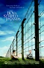
### 穿条纹睡衣的男孩 / The Boy in the Striped Pajamas / 穿条纹衣服的男孩  /  穿条纹衣的男孩
* 导演: 马克·赫门 Mark Herman   主演: 阿沙·巴特菲尔德 Asa Butterfield / ...
* 2008 / 英国 美国 / 剧情 战争
* **8.8** 121673人评价

> 尽管有些不切实际的幻想，这部电影依旧是一部感人肺腑的佳作。

***

## Top 113

### 电锯惊魂 / Saw / 夺魂锯  /  恐惧斗室
* 导演: 詹姆斯·温 James Wan   主演: 雷·沃纳尔 Leigh Whannell / 加利·艾...
* 2004 / 美国 澳大利亚 / 犯罪 悬疑 惊悚
* **8.6** 181298人评价

> 真相就在眼前。

***

## Top 114

### 神偷奶爸 / Despicable Me / 卑鄙的我  /  坏蛋奖门人(港)
* 导演: 皮艾尔·柯芬 Pierre Coffin / 克里斯·雷纳德 Chris Renaud   主演: ...
* 2010 / 美国 / 儿童 喜剧 动画
* **8.5** 337445人评价

> Mr. I Don't Care其实也有Care的时候。

***

## Top 115

### 菊次郎的夏天 / 菊次郎の夏 / Kikujirô no natsu  /  菊次郎的夏天
* 导演: 北野武 Takeshi Kitano   主演: 北野武 Takeshi Kitano / 关口雄介 Yus...
* 1999 / 日本 / 剧情 喜剧
* **8.7** 159588人评价

> 从没见过那么流氓的温柔，从没见过那么温柔的流氓。

***

## Top 116

### 真爱至上 / Love Actually / 爱是您，爱是我(台)  /  真的恋爱了(港)
* 导演: 理查德·柯蒂斯 Richard Curtis   主演: 休·格兰特 Hugh Grant / 柯林...
* 2003 / 英国 美国 法国 / 喜剧 剧情 爱情
* **8.5** 285801人评价

> 爱，是个动词。

***

## Top 117

### 借东西的小人阿莉埃蒂 / 借りぐらしのアリエッティ / 借物少女艾莉缇(台)  /  借东西的小矮人亚莉亚蒂(港)
* 导演: 米林宏昌 Hiromasa Yonebayashi   主演: 志田未来 Mirai Shida / 神木...
* 2010 / 日本 / 动画 奇幻 冒险
* **8.7** 197093人评价

> 曾经的那段美好会沉淀为一辈子的记忆。

***

## Top 118

### 虎口脱险 / La grande vadrouille / 横冲直撞出重围(港)  /  大進擊(台)
* 导演: 杰拉尔·乌里 Gérard Oury   主演: 路易·德·菲耐斯 Louis de Funès...
* 1966 / 法国 英国 / 喜剧 战争
* **8.9** 98775人评价

> 永远看不腻的喜剧。

***

## Top 119

### 岁月神偷 / 歲月神偷 / 1969太空漫游  /  Echoes Of The Rainbow
* 导演: 罗启锐 Alex Law   主演: 吴君如 Sandra Ng / 任达华 Simon Yam / 钟绍...
* 2010 / 香港 中国大陆 / 剧情 家庭
* **8.6** 283052人评价

> 岁月流逝，来日可追。

***

## Top 120

### 雨人 / Rain Man / 手足情未了  /  手足情深
* 导演: 巴瑞·莱文森 Barry Levinson   主演: 达斯汀·霍夫曼 Dustin Hoffman ...
* 1988 / 美国 / 剧情
* **8.6** 193669人评价

> 生活在自己的世界里，也可以让周围的人显得可笑和渺小。

***

## Top 121

### 倩女幽魂 / 倩女幽魂(87版)  /  A Chinese Ghost Story
* 导演: 程小东 Siu-Tung Ching   主演: 张国荣 Leslie Cheung / 王祖贤 Joey W...
* 1987 / 香港 / 剧情 爱情 武侠 古装
* **8.6** 221220人评价

> 两张绝世的脸。 

***

## Top 122

### 贫民窟的百万富翁 / Slumdog Millionaire / 贫民百万富翁(台)  /  一百万零一夜(港)
* 导演: 丹尼·鲍尔 Danny Boyle / 洛芙琳·坦丹 Loveleen Tandan   主演: 戴夫...
* 2008 / 英国 美国 / 剧情 爱情
* **8.5** 369927人评价

> 上帝之城+猜火车+阿甘正传+开心辞典=山寨富翁

***

## Top 123
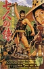
### 七武士 / 七人の侍 / 七侠四义(港)  /  The Seven Samurai
* 导演: 黑泽明 Akira Kurosawa   主演: 三船敏郎 Toshirô Mifune / 志村乔 ...
* 1954 / 日本 / 动作 冒险 剧情
* **9.1** 67818人评价

> 时代悲歌。

***

## Top 124

### 消失的爱人 / Gone Girl / 失踪的女孩  /  失踪女孩
* 导演: 大卫·芬奇 David Fincher   主演: 本·阿弗莱克 Ben Affleck / 罗莎蒙...
* 2014 / 美国 / 剧情 犯罪 悬疑 惊悚
* **8.7** 311648人评价

***

## Top 125

### 记忆碎片 / Memento / 失忆  /  记忆拼图
* 导演: 克里斯托弗·诺兰 Christopher Nolan   主演: 盖·皮尔斯 Guy Pearce /...
* 2000 / 美国 / 犯罪 剧情 悬疑 惊悚
* **8.5** 252309人评价

> 一个针管引发的血案。

***

## Top 126

### 东邪西毒 / 東邪西毒 / Ashes of Time
* 导演: 王家卫 Kar Wai Wong   主演: 张国荣 Leslie Cheung / 张曼玉 Maggie C...
* 1994 / 香港 台湾 / 剧情 动作 爱情 武侠 古装
* **8.6** 228491人评价

> 电影诗。

***

## Top 127
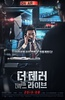
### 恐怖直播 / 더 테러 라이브 / 死亡“动”新闻(港)  /  恐怖攻击直播(台)
* 导演: 金秉祐 Byeong-woo Kim   主演: 河正宇 Jung-woo Ha / 李璟荣 Kyeong-y...
* 2013 / 韩国 / 剧情 犯罪 悬疑
* **8.7** 187286人评价

> 恐怖分子的“秋菊打官司”。

***

## Top 128

### 疯狂原始人 / The Croods / 古鲁家族(港 / 台) 
* 导演: 科克·德·米科 Kirk De Micco / 克里斯·桑德斯 Chris Sanders   主演...
* 2013 / 美国 / 喜剧 动画 冒险
* **8.7** 342371人评价

> 老少皆宜，这就是好莱坞动画的魅力。

***

## Top 129

### 怪兽电力公司 / Monsters, Inc. / 怪兽公司(港)  /  怪物公司
* 导演: 彼特·道格特 Pete Docter / 大卫·斯沃曼 David Silverman   主演: 约...
* 2001 / 美国 / 喜剧 动画 儿童 奇幻
* **8.6** 214788人评价

> 不要给它起名字，起了名字就有感情了。

***

## Top 130

### 杀人回忆 / 살인의 추억 / 谋杀回忆  /  杀手回忆录
* 导演: 奉俊昊 Joon-ho Bong   主演: 宋康昊 Kang-ho Song / 金相庆 Sang-kyun...
* 2003 / 韩国 / 犯罪 剧情 悬疑 惊悚
* **8.6** 184226人评价

> 关于连环杀人悬案的集体回忆。

***

## Top 131

### 穿越时空的少女 / 時をかける少女 / 跳跃吧！时空少女(台)  /  Toki o kakeru shôjo
* 导演: 细田守 Mamoru Hosoda   主演: 仲里依纱 Riisa Naka / 石田卓也 Takuya...
* 2006 / 日本 / 剧情 爱情 科幻 动画
* **8.6** 168973人评价

> 爱上未来的你。 

***

## Top 132

### 卢旺达饭店 / Hotel Rwanda / 卢安达饭店(台)
* 导演: 特瑞·乔治 Terry George   主演: 唐·钱德尔 Don Cheadle / 苏菲·奥...
* 2004 / 英国 南非 意大利 美国 / 剧情 历史 战争
* **8.8** 106321人评价

> 当这个世界闭上双眼，他却敞开了怀抱。

***

## Top 133

### 红辣椒 / パプリカ / 盗梦侦探  /  帕布莉卡
* 导演: 今敏 Satoshi Kon   主演: 林原惠美 Megumi Hayashibara / 古谷彻 T...
* 2006 / 日本 / 动画 悬疑 科幻 惊悚
* **8.8** 110504人评价

> 梦的勾结。

***

## Top 134

### 魂断蓝桥 / Waterloo Bridge / 滑铁卢桥  /  断桥残梦
* 导演: Mervyn LeRoy   主演: Vivien Leigh / Robert Taylor / Lucile Watson
* 1940 / 美国 / 剧情 战争 爱情
* **8.8** 119586人评价

> 中国式内在的美国电影。

***

## Top 135

### 恋恋笔记本 / The Notebook / 深情日记  /  写我情真
* 导演: 尼克·卡索维茨 Nick Cassavetes   主演: 瑞恩·高斯林 Ryan Gosling /...
* 2004 / 美国 / 剧情 爱情
* **8.5** 251308人评价

> 爱情没有那么多借口，如果不能圆满，只能说明爱的不够。 

***

## Top 136

### 黑天鹅 / Black Swan / 夺命黑天鹅  /  霸王别鹅(豆友译名)
* 导演: 达伦·阿罗诺夫斯基 Darren Aronofsky   主演: 娜塔丽·波曼 Natalie P...
* 2010 / 美国 / 剧情 惊悚
* **8.5** 382606人评价

> 黑暗之美。

***

## Top 137

### 猜火车 / Trainspotting / 迷幻列车(港)  /  定位的火车
* 导演: 丹尼·鲍尔 Danny Boyle   主演: 伊万·麦克格雷格 Ewan McGregor / 艾...
* 1996 / 英国 / 犯罪 剧情
* **8.5** 223834人评价

> 不可猜的青春迷笛。 

***

## Top 138

### 英雄本色 / A Better Tomorrow  /  Gangland Boss
* 导演: 吴宇森 John Woo   主演: 周润发 Yun-Fat Chow / 狄龙 Lung Ti / 张国...
* 1986 / 香港 / 动作 犯罪
* **8.7** 131381人评价

> 英雄泪短，兄弟情长。 

***

## Top 139

### 傲慢与偏见 / Pride & Prejudice / 傲慢与偏见2005  /  Pride And Prejudice
* 导演: 乔·怀特 Joe Wright   主演: 凯拉·奈特莉 Keira Knightley / 马修·...
* 2005 / 法国 英国 美国 / 剧情 爱情
* **8.4** 270337人评价

> 爱是摈弃傲慢与偏见之后的曙光。

***

## Top 140

### 喜宴 / The Wedding Banquet
* 导演: 李安   主演: 赵文瑄 / 归亚蕾 / 金素梅
* 1993 / 台湾 美国 / 剧情 喜剧 爱情 同性 家庭
* **8.7** 120230人评价

> 中国家庭的喜怒哀乐忍。

***

## Top 141

### 教父3 / The Godfather: Part III / 教父第三集  /  教父 III
* 导演: 弗朗西斯·福特·科波拉 Francis Ford Coppola   主演: 阿尔·帕西诺 A...
* 1990 / 美国 / 剧情 犯罪
* **8.7** 116340人评价

> 任何信念的力量，都无法改变命运。

***

## Top 142

### 雨中曲 / Singin' in the Rain / 雨中情  /  万花嬉春
* 导演: Stanley Donen / Gene Kelly   主演: Gene Kelly / Donald O'Connor / ...
* 1952 / 美国 / 喜剧 歌舞 爱情
* **8.9** 83840人评价

> 骨灰级歌舞片。

***

## Top 143

### 完美的世界 / A Perfect World / 强盗保镳
* 导演: 克林特·伊斯特伍德 Clint Eastwood   主演: 凯文·科斯特纳 Kevin Cos...
* 1993 / 美国 / 剧情 犯罪
* **9.0** 70250人评价

> 坏人的好总是比好人的好来得更感人。

***

## Top 144

### 玩具总动员3 / Toy Story 3 / 反斗奇兵3(港)  /  玩具的故事3
* 导演: 李·昂克里奇 Lee Unkrich   主演: 汤姆·汉克斯 Tom Hanks / 蒂姆·艾...
* 2010 / 美国 / 喜剧 动画 奇幻 冒险
* **8.7** 178617人评价

> 跨度十五年的欢乐与泪水。

***

## Top 145

### 纵横四海 / 緃横四海 / Once a Thief
* 导演: 吴宇森 John Woo   主演: 周润发 Yun-Fat Chow / 张国荣 Leslie Cheung...
* 1991 / 香港 / 剧情 喜剧 动作 犯罪
* **8.7** 125692人评价

> 香港浪漫主义警匪动作片的巅峰之作。

***

## Top 146

### 人工智能 / Artificial Intelligence: AI / AI人工智慧
* 导演: 史蒂文·斯皮尔伯格 Steven Spielberg   主演: 海利·乔·奥斯蒙 Haley...
* 2001 / 美国 / 冒险 剧情 科幻
* **8.6** 173329人评价

> 对爱的执着，可以超越一切。

***

## Top 147

### 萤火之森 / 蛍火の杜へ / 萤火之社  /  Hotarubi no mori e
* 导演: 大森贵弘 Takahiro Omori   主演: 佐仓绫音 Ayane Sakura / 内山昂辉 K...
* 2011 / 日本 / 剧情 爱情 动画 奇幻
* **8.7** 136746人评价

> 触不到的恋人。

***

## Top 148

### 小森林 夏秋篇 / リトル・フォレスト 夏・秋 / 小森食光 / 夏秋篇(台) 
* 导演: 森淳一 Junichi Mori   主演: 桥本爱 Ai Hashimoto / 三浦贵大 Takahir...
* 2014 / 日本 / 剧情
* **8.9** 105143人评价

***

## Top 149

### 我是山姆 / I Am Sam / 不一样的爸爸(港)  /  他不笨，他是我爸爸(台)
* 导演: 杰茜·尼尔森 Jessie Nelson   主演: Sean Penn / Dakota Fanning / Mi...
* 2001 / 美国 / 剧情 家庭
* **8.8** 90955人评价

> 爱并不需要智商 。

***

## Top 150

### 喜剧之王 / 喜劇之王 / King of Comedy
* 导演: 周星驰 Stephen Chow / 李力持 Lik-Chi Lee   主演: 周星驰 Stephen Ch...
* 1999 / 香港 / 喜剧 剧情 爱情
* **8.4** 268558人评价

> 我是一个演员。

***

## Top 151

### 香水 / Perfume: The Story of a Murderer / 香水：一个杀人犯的故事  /  香水：一个谋杀犯的故事
* 导演: 汤姆·提克威 Tom Tykwer   主演: 本·卫肖 Ben Whishaw / 艾伦·瑞克...
* 2006 / 德国 法国 西班牙 美国 / 剧情 犯罪 奇幻
* **8.4** 250693人评价

> 一个单凭体香达到高潮的男人。

***

## Top 152

### 冰川时代 / Ice Age / 冰河世纪  /  冰原历险记
* 导演: 卡洛斯·沙尔丹哈 Carlos Saldanha / 克里斯·韦奇 Chris Wedge   主演...
* 2002 / 美国 / 喜剧 动画 冒险
* **8.4** 246819人评价

> 松鼠才是角儿。

***

## Top 153

### 浪潮 / Die Welle / 恶魔教室(台)  /  白恤暴潮(港)
* 导演: 丹尼斯·甘塞尔 Dennis Gansel   主演: 尤尔根·沃格尔 Jürgen Vogel ...
* 2008 / 德国 / 剧情 惊悚
* **8.7** 115904人评价

> 世界离独裁只有五天。

***

## Top 154

### 撞车 / Crash / 冲击效应  /  冲撞
* 导演: 保罗·哈吉斯 Paul Haggis   主演: 桑德拉·布洛克 Sandra Bullock / ...
* 2004 / 美国 德国 / 犯罪 剧情
* **8.6** 160174人评价

> 天使与魔鬼的冲撞。

***

## Top 155

### 哈利·波特与死亡圣器(下) / Harry Potter and the Deathly Hallows: Part 2 / 哈利波特7：死神的圣物2(港 / 台) 
* 导演: 大卫·叶茨 David Yates   主演: 丹尼尔·雷德克里夫 Daniel Radcliffe...
* 2011 / 美国 英国 / 剧情 悬疑 奇幻 冒险
* **8.6** 247653人评价

> 10年的完美句点。

***

## Top 156

### 7号房的礼物 / 7번방의 선물 / 戆爸的礼物(港)  /  7号囚房的礼物
* 导演: 李焕庆 Hwan-kyeong Lee   主演: 柳承龙 Seung-yong Ryoo / 朴信惠 Shi...
* 2013 / 韩国 / 剧情 喜剧 家庭
* **8.7** 148836人评价

> 《我是山姆》的《美丽人生》。

***

## Top 157
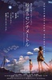
### 秒速5厘米 / 秒速5センチメートル / 秒速五厘米  /  秒速5公分
* 导演: 新海诚 Makoto Shinkai   主演: 水桥研二 Kenji Mizuhashi / 近藤好美 ...
* 2007 / 日本 / 动画 剧情 爱情
* **8.4** 262338人评价

> 青春就是放弃和怀念。

***

## Top 158

### 朗读者 / The Reader / 为爱朗读(台)  /  读爱(港)
* 导演: 史蒂芬·戴德利 Stephen Daldry   主演: 凯特·温丝莱特 Kate Winslet ...
* 2008 / 美国 德国 / 剧情 爱情
* **8.5** 257400人评价

> 当爱情跨越年龄的界限，它似乎能变得更久远一点，成为一种责任，一种水到渠成的相濡以沫。 

***

## Top 159

### 碧海蓝天 / Le grand bleu / 碧海情深  /  夜海倾情
* 导演: Luc Besson   主演: Jean-Marc Barr / Jean Reno / Rosanna Arquette
* 1988 / 法国 美国 意大利 / 剧情 爱情
* **8.7** 101556人评价

> 在那片深蓝中，感受来自大海的忧伤寂寞与美丽自由。

***

## Top 160

### 追随 / Following / 致命追踪  /  跟踪
* 导演: 克里斯托弗·诺兰 Christopher Nolan   主演: 杰里米·西奥伯德 Jeremy...
* 1998 / 英国 / 犯罪 悬疑 惊悚
* **9.0** 69421人评价

> 诺兰的牛逼来源于内心散发出的恐惧。

***

## Top 161

### 花样年华 / 花樣年華 / In the Mood for Love
* 导演: 王家卫 Kar Wai Wong   主演: 梁朝伟 Tony Leung Chiu Wai / 张曼玉 Ma...
* 2000 / 香港 法国 / 剧情 爱情
* **8.4** 216323人评价

> 偷情本没有这样美。

***

## Top 162

### 罗生门 / 羅生門 / Rashomon
* 导演: 黑泽明 Akira Kurosawa   主演: 三船敏郎 Toshirô Mifune / 千秋实 ...
* 1950 / 日本 / 犯罪 剧情 悬疑
* **8.7** 108407人评价

> 人生的N种可能性。

***

## Top 163

### 梦之安魂曲 / Requiem for a Dream / 噩梦挽歌(台)  /  迷上瘾(港)
* 导演: 达伦·阿伦诺夫斯基 Darren Aronofsky   主演: 艾伦·伯斯汀 Ellen Bur...
* 2000 / 美国 / 剧情
* **8.7** 98802人评价

> 一场没有春天的噩梦。

***

## Top 164

### 战争之王 / Lord of War / 军火之王(台 / 港) 
* 导演: 安德鲁·尼科尔 Andrew Niccol   主演: 尼古拉斯·凯奇 Nicolas Cage /...
* 2005 / 美国 法国 / 剧情 犯罪
* **8.5** 158828人评价

> 做一颗让别人需要你的棋子。

***

## Top 165

### 可可西里 / Kekexili: Mountain Patrol
* 导演: 陆川 Chuan Lu   主演: 多布杰 Duobujie / 张磊 Lei Zhang / 亓亮 Qi L...
* 2004 / 中国大陆 香港 / 剧情 犯罪
* **8.6** 116636人评价

> 坚硬的信仰。

***

## Top 166

### 海盗电台 / The Boat That Rocked / 出位乐人谷(港)  /  海盗电波
* 导演: 理查德·柯蒂斯 Richard Curtis   主演: 比尔·奈伊 Bill Nighy / 肯尼...
* 2009 / 英国 德国 法国 / 剧情 喜剧 音乐
* **8.6** 155321人评价

> 生命不止，摇滚不死。

***

## Top 167

### 一次别离 / جدایی نادر از سیمین / 分居风暴(台)  /  伊朗式分居(港)
* 导演: 阿斯哈·法哈蒂  Asghar Farhadi   主演: 蕾拉·哈塔米 Leila Hatami /...
* 2011 / 伊朗 / 剧情 家庭
* **8.7** 118215人评价

> 只有有信仰的人才能说出事实真相。

***

## Top 168

### 心迷宫 / 殡棺  /  The Coffin in the Mountain
* 导演: 忻钰坤 Yukun Xin   主演: 霍卫民 Weimin Huo / 王笑天 Xiaotian Wang ...
* 2014 / 中国大陆 / 剧情 犯罪 悬疑
* **8.6** 131612人评价

***

## Top 169

### 唐伯虎点秋香 / 唐伯虎點秋香 / Flirting Scholar
* 导演: 李力持 Lik-Chi Lee   主演: 周星驰 Stephen Chow / 巩俐 Li Gong / 陈...
* 1993 / 香港 / 喜剧 爱情 古装
* **8.3** 278750人评价

> 华太师是黄霑，吴镇宇四大才子之一。

***

## Top 170

### 超能陆战队 / Big Hero 6 / 大英雄联盟(港)  /  大英雄天团(台)
* 导演: 唐·霍尔 Don Hall / 克里斯·威廉姆斯 Chris Williams   主演: 斯科特...
* 2014 / 美国 / 喜剧 动作 科幻 动画 冒险
* **8.6** 327337人评价

***

## Top 171

### 时空恋旅人 / About Time / 时空旅恋人  /  回到最爱的一天(港)
* 导演: 理查德·柯蒂斯 Richard Curtis   主演: 多姆纳尔·格利森 Domhnall Gl...
* 2013 / 英国 / 剧情 爱情 奇幻
* **8.6** 168478人评价

> 把每天当作最后一天般珍惜度过，积极拥抱生活，就是幸福。

***

## Top 172

### 谍影重重2 / The Bourne Supremacy / 叛谍追击2：机密圈套(港)  /  神鬼认证：神鬼疑云(台)
* 导演: 保罗·格林格拉斯 Paul Greengrass   主演: 马特·达蒙 Matt Damon / ...
* 2004 / 美国 德国 / 动作 悬疑 冒险
* **8.5** 143520人评价

> 谁说王家卫镜头很晃？

***

## Top 173

### 谍影重重 / The Bourne Identity / 叛谍追击(港)  /  神鬼认证(台)
* 导演: 道格·里曼 Doug Liman   主演: 马特·达蒙 Matt Damon / 弗兰卡·波坦...
* 2002 / 美国 德国 捷克 / 动作 悬疑 冒险
* **8.5** 174097人评价

> 哗啦啦啦啦，天在下雨，哗啦啦啦啦，云在哭泣……找自己。

***

## Top 174

### 迁徙的鸟 / Le peuple migrateur / 鸟的迁徙  /  鸟与梦飞行
* 导演: 雅克·贝汉 Jacques Perrin / 雅克·克鲁奥德 Jacques Cluzaud   主演:...
* 2001 / 法国 德国 意大利 西班牙 瑞士 / 纪录片
* **9.1** 48381人评价

> 最美的飞翔。

***

## Top 175

### 荒野生存 / Into the Wild / 浪荡天涯(港)  /  阿拉斯加之死(台)
* 导演: 西恩·潘 Sean Penn   主演: 埃米尔·赫斯基 Emile Hirsch / 马西娅·...
* 2007 / 美国 / 冒险 传记 剧情
* **8.6** 115758人评价

> 出门必备：本草纲目。

***

## Top 176

### 地球上的星星 / Taare Zameen Par / 心中的小星星(台)  /  每一个孩子都是特别的
* 导演: 阿米尔·汗 Aamir Khan / 阿莫尔·古普特 Amole Gupte   主演: 达席尔...
* 2007 / 印度 / 剧情 儿童 家庭
* **8.8** 70000人评价

> 天使保护事件始末。

***

## Top 177

### 蝙蝠侠：黑暗骑士崛起 / The Dark Knight Rises / 蝙蝠侠前传3：黑暗骑士崛起  /  黑暗骑士：黎明升起(台)
* 导演: 克里斯托弗·诺兰 Christopher Nolan   主演: 克里斯蒂安·贝尔 Christ...
* 2012 / 美国 英国 / 剧情 动作 科幻 犯罪 惊悚
* **8.5** 266163人评价

> 诺兰就是保证。

***

## Top 178

### 阿飞正传 / 阿飛正傳 / Days of Being Wild
* 导演: 王家卫 Kar Wai Wong   主演: 张国荣 Leslie Cheung / 张曼玉 Maggie C...
* 1990 / 香港 / 犯罪 剧情 爱情
* **8.5** 156860人评价

> 王家卫是一种风格，张国荣是一个代表。

***

## Top 179

### 绿里奇迹 / The Green Mile / 绿色奇迹(台)  /  绿色英里
* 导演: Frank Darabont   主演: 汤姆·汉克斯 Tom Hanks / 大卫·摩斯 David M...
* 1999 / 美国 / 犯罪 剧情 奇幻 悬疑
* **8.7** 95325人评价

> 天使暂时离开。

***

## Top 180

### 勇闯夺命岛 / The Rock / 石破天惊  /  绝地任务
* 导演: 迈克尔·贝 Michael Bay   主演: 肖恩·康纳利 Sean Connery / 尼古拉...
* 1996 / 美国 / 动作 冒险
* **8.5** 129341人评价

> 类型片的极致。 

***

## Top 181

### 燕尾蝶 / スワロウテイル / Swallowtail Butterfly  /  Suwarôteiru
* 导演: 岩井俊二 Shunji Iwai   主演: 三上博史 / 恰拉 / 伊藤步
* 1996 / 日本 / 犯罪 剧情
* **8.6** 100566人评价

> 现实与童话交相辉映的旅程。

***

## Top 182

### 恐怖游轮 / Triangle / 汪洋血迷宮(台)  /  轮回三角
* 导演: 克里斯托弗·史密斯 Christopher Smith   主演: 梅利莎·乔治 Melissa ...
* 2009 / 英国 澳大利亚 / 剧情 悬疑 惊悚
* **8.3** 274445人评价

> 不要企图在重复中寻找已经失去的爱。

***

## Top 183

### 荒蛮故事 / Relatos salvajes / 蛮荒故事  /  生命中最抓狂的小事(台)
* 导演: Damián Szifron   主演: 里卡杜·达林 Ricardo Darín / 艾丽卡·里瓦...
* 2014 / 阿根廷 西班牙 / 剧情 喜剧 犯罪
* **8.7** 108028人评价

***

## Top 184

### 惊魂记 / Psycho / 精神病患者  /  触目惊心
* 导演: Alfred Hitchcock   主演: Janet Leigh / Anthony Perkins / Vera Miles
* 1960 / 美国 / 悬疑 恐怖
* **8.8** 71631人评价

> 故事的反转与反转，分裂电影的始祖。

***

## Top 185

### 卡萨布兰卡 / Casablanca / 北非谍影(港)  /  卡萨布兰卡
* 导演: Michael Curtiz   主演: 亨弗莱·鲍嘉 Humphrey Bogart / 英格丽·褒曼...
* 1942 / 美国 / 剧情 爱情 战争
* **8.6** 112007人评价

> 与同名歌曲无关。

***

## Top 186

### 魔女宅急便 / 魔女の宅急便 / 魔女琪琪(台)  /  小魔女限时专送
* 导演: 宫崎骏 Hayao Miyazaki   主演: 高山南 / 佐久间玲 / 山口胜平
* 1989 / 日本 / 动画 奇幻 冒险
* **8.4** 171595人评价

> 宫崎骏的电影总让人感觉世界是美好的，阳光明媚的。

***

## Top 187

### 再次出发之纽约遇见你 / Begin Again / 再次出发  /  歌曲改变人生
* 导演: 约翰·卡尼 John Carney   主演: 凯拉·奈特莉 Keira Knightley / 马克...
* 2013 / 美国 / 喜剧 爱情 音乐
* **8.5** 143144人评价

> 爱我就给我看你的播放列表。

***

## Top 188

### 达拉斯买家俱乐部 / Dallas Buyers Club / 续命枭雄(港)  /  药命俱乐部(台)
* 导演: 让-马克·瓦雷 Jean-Marc Vallée   主演: 马修·麦康纳 Matthew McCon...
* 2013 / 美国 / 剧情 传记 同性
* **8.6** 147898人评价

> Jared Leto的腿比女人还美！

***

## Top 189

### 小森林 冬春篇 / リトル・フォレスト 冬・春 / 小森食光 / 冬春篇(台) 
* 导演: 森淳一 Junichi Mori   主演: 桥本爱 Ai Hashimoto / 三浦贵大 Takahir...
* 2015 / 日本 / 剧情
* **8.9** 90669人评价

***

## Top 190

### 英国病人 / The English Patient / 英伦情人(台)  /  别问我是谁(港)
* 导演: 安东尼·明格拉 Anthony Minghella   主演: 拉尔夫·费因斯 Ralph Fien...
* 1996 / 美国 英国 / 爱情 剧情 战争
* **8.4** 161479人评价

> In memory, love lives forever...

***

## Top 191

### 这个男人来自地球 / The Man from Earth / 地球不死人(港)  /  这个人来自洞穴
* 导演: 理查德·沙因克曼 Richard Schenkman   主演: 大卫·李·史密斯 David ...
* 2007 / 美国 / 剧情 科幻
* **8.5** 155994人评价

> 科幻真正的魅力不是视觉效果能取代的。 

***

## Top 192

### 变脸 / Face/Off / 夺面双雄
* 导演: 吴宇森 John Woo   主演: 约翰·特拉沃尔塔 John Travolta / 尼古拉斯...
* 1997 / 美国 / 动作 科幻 犯罪
* **8.4** 195176人评价

> 当发哥的风衣、墨镜出现在了凯奇身上⋯⋯

***

## Top 193

### 东京物语 / 東京物語 / 东京故事  /  Tokyo Story
* 导演: 小津安二郎 Yasujirô Ozu   主演: 笠智众 Chishû Ryû / 原节...
* 1953 / 日本 / 剧情 家庭
* **9.2** 43297人评价

> 东京那么大，如果有一天走失了，恐怕一辈子不能再相见。

***

## Top 194

### 终结者2：审判日 / Terminator 2: Judgment Day / 终结者2  /  终结者2：末日审判
* 导演: 詹姆斯·卡梅隆 James Cameron   主演: 阿诺·施瓦辛格 Arnold Schwarz...
* 1991 / 美国 法国 / 动作 科幻
* **8.5** 126933人评价

> 少见的超越首部的续集，动作片中的经典。

***

## Top 195

### 未麻的部屋 / Perfect Blue / 蓝色的恐惧  /  蓝色恐惧
* 导演: 今敏 Satoshi Kon   主演: 岩男润子 Junko Iwao / 松本梨香 Rica Matsu...
* 1997 / 日本 / 动画 奇幻 惊悚
* **8.8** 77065人评价

> 好的剧本是，就算你猜到了结局也猜不到全部。

***

## Top 196

### 叫我第一名 / Front of the Class / 开放有爱  /  站在教室前
* 导演: 彼得·维纳 Peter Werner   主演: 詹姆斯·沃克 James Wolk / 特里特·...
* 2008 / 美国 / 剧情 传记
* **8.6** 98206人评价

> 乐观比一切都有力量。

***

## Top 197
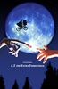
### E.T. 外星人 / E.T.: The Extra-Terrestrial / 外星人E.T.  /  外星人
* 导演: Steven Spielberg   主演: Henry Thomas / Dee Wallace / Robert MacNa...
* 1982 / 美国 / 剧情 科幻 奇幻 冒险
* **8.5** 137056人评价

> 生病的E.T.皮肤的颜色就像柿子饼。

***

## Top 198

### 被解救的姜戈 / Django Unchained / 被解放的姜戈  /  决杀令(台)
* 导演: 昆汀·塔伦蒂诺 Quentin Tarantino   主演: 杰米·福克斯 Jamie Foxx /...
* 2012 / 美国 / 剧情 动作 西部 冒险
* **8.5** 235544人评价

> 热血沸腾，那个低俗、性感的无耻混蛋又来了。

***

## Top 199

### 牯岭街少年杀人事件 / 牯嶺街少年殺人事件 / A Brighter Summer Day
* 导演: 杨德昌 Edward Yang   主演: 张震 Chen Chang / 杨静怡 Lisa Yang / 张...
* 1991 / 台湾 / 剧情 犯罪
* **8.7** 89911人评价

> 弱者送给弱者的一刀。

***

## Top 200

### 爆裂鼓手 / Whiplash / 鼓动真我(港)  /  进击的鼓手(台)
* 导演: 达米安·沙泽勒 Damien Chazelle   主演: 迈尔斯·特勒 Miles Teller /...
* 2014 / 美国 / 剧情 音乐
* **8.6** 203127人评价

***

## Top 201

### 末路狂花 / Thelma & Louise / 塞尔玛与路易丝  /  末路狂花
* 导演: 雷德利·斯科特 Ridley Scott   主演: 吉娜·戴维斯 Geena Davis / 苏...
* 1991 / 美国 法国 / 犯罪 剧情 惊悚
* **8.7** 90611人评价

> 没有了退路，只好飞向自由。

***

## Top 202

### 穆赫兰道 / Mulholland Dr. / 穆荷兰大道(台)  /  失忆大道(港)
* 导演: 大卫·林奇 David Lynch   主演: 娜奥米·沃茨 Naomi Watts / 劳拉·哈...
* 2001 / 法国 美国 / 剧情 悬疑 惊悚
* **8.3** 208464人评价

> 大卫·林奇的梦境迷宫。

***

## Top 203
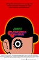
### 发条橙 / A Clockwork Orange / 发条桔子  /  发条橙子
* 导演: Stanley Kubrick   主演: Malcolm McDowell / Patrick Magee / Michael...
* 1971 / 英国 美国 / 犯罪 剧情 科幻
* **8.4** 168292人评价

> 我完全康复了。

***

## Top 204

### 哪吒闹海 / Prince Nezha's Triumph Against Dragon King  /  Nezha nao hai
* 导演: 严定宪 Dingxian Yan / 王树忱 Shuchen Wang   主演: 梁正晖 / 邱岳峰 ...
* 1979 / 中国大陆 / 冒险 动画 奇幻
* **8.8** 69731人评价

> 想你时你在闹海。

***

## Top 205

### 忠犬八公物语 / ハチ公物語 / 八千公物语  /  阿八的故事
* 导演: Seijirô Kôyama   主演: 山本圭 Kei Yamamoto / 井川比佐志 Hisa...
* 1987 / 日本 / 剧情
* **9.0** 47128人评价

> 养狗三日，便会对你终其一生。

***

## Top 206

### 源代码 / Source Code / 启动原始码(台)  /  危机解密(港)
* 导演: 邓肯·琼斯 Duncan Jones   主演: 杰克·吉伦哈尔 Jake Gyllenhaal / ...
* 2011 / 美国 加拿大 / 剧情 动作 科幻 犯罪 惊悚
* **8.3** 371660人评价

> 邓肯·琼斯继《月球》之后再度奉献出一部精彩绝伦的科幻佳作。

***

## Top 207
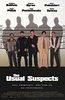
### 非常嫌疑犯 / The Usual Suspects / 刺激惊爆点(台)  /  普通嫌疑犯
* 导演: 布莱恩·辛格 Bryan Singer   主演: 史蒂芬·鲍德温 Stephen Baldwin /...
* 1995 / 德国 美国 / 剧情 犯罪 悬疑 惊悚
* **8.6** 103036人评价

> 我不信仰上帝，但我敬畏上帝。

***

## Top 208

### 黑客帝国3：矩阵革命 / The Matrix Revolutions / 骇客任务完结篇：最后战役  /  廿二世纪杀人网络3：惊变世纪
* 导演: Andy Wachowski / Larry Wachowski   主演: Keanu Reeves / Laurence F...
* 2003 / 美国 澳大利亚 / 动作 科幻
* **8.5** 137195人评价

> 不得不说，《黑客帝国》系列是商业片与科幻、哲学完美结合的典范。

***

## Top 209

### 新龙门客栈 / 新龍門客棧 / New Dragon Gate Inn
* 导演: 李惠民 Raymond Lee   主演: 张曼玉 Maggie Cheung / 林青霞 Brigitte ...
* 1992 / 香港 中国大陆 / 剧情 动作 武侠 古装
* **8.4** 162712人评价

> 嬉笑怒骂，调风动月。

***

## Top 210

### 美国丽人 / American Beauty / 美丽有罪(港)  /  美国心·玫瑰情(台)
* 导演: 萨姆·门德斯 Sam Mendes   主演: 凯文·史佩西 Kevin Spacey / 安妮特...
* 1999 / 美国 / 剧情 家庭
* **8.4** 166264人评价

> 每个人的内心都是深不可测的大海。 

***

## Top 211

### 青蛇 / Green Snake
* 导演: 徐克 Hark Tsui   主演: 张曼玉 Maggie Cheung / 王祖贤 Joey Wang / ...
* 1993 / 香港 / 剧情 奇幻 古装
* **8.4** 192984人评价

> 人生如此，浮生如斯。谁人言，花彼岸，此生情长意短。谁都是不懂爱的罢了。

***

## Top 212

### 黄金三镖客 / Il buono, il brutto, il cattivo. / 好·坏·丑  /  独行侠决斗地狱门(港)
* 导演: Sergio Leone   主演: Clint Eastwood / Eli Wallach / Lee Van Cleef
* 1966 / 意大利 西班牙 西德 / 冒险 西部
* **9.1** 44457人评价

> 最棒的西部片。

***

## Top 213

### 上帝也疯狂 / The Gods Must Be Crazy / 众神也疯狂 (上)  /  上帝一定发疯了 (上)
* 导演: Jamie Uys   主演: Marius Weyers / Sandra Prinsloo / N!xau
* 1980 / 博茨瓦纳 南非 / 喜剧
* **8.6** 86732人评价

> 纯净原始的笑与感动。

***

## Top 214

### 爱·回家 / 집으로... / 外婆的家  /  回家路上
* 导演: 李廷香 Jeong-hyang Lee   主演: 金艺芬 Eul-boon Kim / 俞承豪 Seung-...
* 2002 / 韩国 / 剧情 儿童 家庭
* **9.1** 42447人评价

> 献给所有外婆的电影。

***

## Top 215

### 无耻混蛋 / Inglourious Basterds / 恶棍特工(台)  /  希魔撞正杀人狂(港)
* 导演: Quentin Tarantino   主演: 布拉德·皮特 Brad Pitt / 梅拉尼·罗兰 M...
* 2009 / 美国 德国 / 剧情 犯罪
* **8.4** 201328人评价

> 昆汀同学越来越变态了，比北野武还杜琪峰。

***

## Top 216

### 勇士 / Warrior / 勇者无敌(台)  /  钢铁斗士(港)
* 导演: 加文·欧康诺 Gavin O'Connor   主演: 汤姆·哈迪 Tom Hardy / 乔尔·...
* 2011 / 美国 / 剧情 运动 家庭
* **8.9** 78877人评价

> 热血沸腾，相当完美的娱乐拳击大餐。

***

## Top 217

### 初恋这件小事 / สิ่งเล็กเล็กที่เรียกว่า...รัก / 初恋那件小事(港)  /  暗恋那点小事
* 导演: Puttipong Promsaka Na Sakolnakorn / Wasin pokpong   主演: 马里奥·...
* 2010 / 泰国 / 喜剧 爱情
* **8.2** 412269人评价

> 黑小鸭速效美白记。

***

## Top 218

### 城市之光 / City Lights / City Lights: A Comedy Romance in Pantomime  /  Lichter der Großstadt
* 导演: Charles Chaplin   主演: 查理·卓别林 Charles Chaplin / 弗吉尼亚·...
* 1931 / 美国 / 喜剧 剧情 爱情
* **9.2** 36612人评价

> 永远的小人物，伟大的卓别林。

***

## Top 219

### 曾经 / Once / 一奏倾情(港)  /  曾经。爱是唯一(台)
* 导演: 约翰·卡尼 John Carney   主演: 格伦·汉塞德 Glen Hansard / 玛可塔...
* 2006 / 爱尔兰 / 剧情 音乐 爱情
* **8.3** 187210人评价

> 有些幸福无关爱情。

***

## Top 220

### 蓝色大门 / 藍色大門 / Blue Gate Crossing  /  蓝色大门
* 导演: 易智言 Chih-yen Yee   主演: 桂纶镁 Lunmei Kwai / 陈柏霖 Bo-lin Che...
* 2002 / 台湾 法国 / 剧情 爱情 同性
* **8.2** 251188人评价

> 青春的窃窃私语。 

***

## Top 221

### 麦兜故事 / 麥兜故事 / 麦兜的故事  /  My Life as McDull
* 导演: 袁建滔 Toe Yuen   主演: 李晋纬 / 林海峰 Jan Lamb / 吴君如 Sandra Ng
* 2001 / 香港 / 剧情 喜剧 动画
* **8.5** 116253人评价

> 麦兜是一只很哲学的猪。 

***

## Top 222

### 暖暖内含光 / Eternal Sunshine of the Spotless Mind / 暧暧内含光  /  美丽心灵的永恒阳光
* 导演: 米歇尔·冈瑞 Michel Gondry   主演: 金·凯瑞 Jim Carrey / 凯特·温...
* 2004 / 美国 / 剧情 爱情 奇幻
* **8.4** 130805人评价

> 恋爱是一次神经的冒险。就算失去记忆，也会爱上你。

***

## Top 223

### 蝴蝶 / Le Papillon / The Butterfly
* 导演: 菲利普·穆伊尔 Philippe Muyl   主演: 米歇尔·塞罗 Michel Serrault ...
* 2002 / 法国 / 剧情 儿童 喜剧
* **8.6** 88626人评价

> 我们长途跋涉寻找的东西，有可能一直就在身边。 

***

## Top 224

### 无敌破坏王 / Wreck-It Ralph / 破坏王拉尔夫  /  破坏王大冒险
* 导演: 瑞奇·莫尔 Rich Moore   主演: 简·林奇 Jane Lynch / 约翰·C·赖利 ...
* 2012 / 美国 / 喜剧 动画 冒险
* **8.7** 167984人评价

> 迪士尼和皮克斯拿错剧本的产物。

***

## Top 225

### 与狼共舞 / Dances with Wolves / 与狼共舞
* 导演: Kevin Costner   主演: Kevin Costner / Mary McDonnell / Graham Greene
* 1990 / 美国 / 冒险 剧情 西部
* **8.9** 51592人评价

> 充满诗意与情怀的史诗作品。 

***

## Top 226

### 巴黎淘气帮 / Le petit Nicolas / 小淘气尼古拉(台)  /  反斗小尼哥(港)
* 导演: Laurent Tirard   主演: 马克西姆·戈达尔 Maxime Godart / 瓦莱丽·勒...
* 2009 / 法国 比利时 / 儿童 喜剧 家庭
* **8.6** 97349人评价

> 四百击的反面。

***

## Top 227

### 大卫·戈尔的一生 / The Life of David Gale / 铁案悬谜  /  命悬一线
* 导演: Alan Parker   主演: 凯文·史派西 Kevin Spacey / 凯特·温丝莱特 Kat...
* 2003 / 美国 德国 英国 / 剧情 犯罪 悬疑
* **8.7** 75003人评价

> 捍卫人权只是信仰，一点不妨碍其行为的残忍。

***

## Top 228
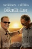
### 遗愿清单 / The Bucket List / 玩转身前事(港)  /  一路玩到挂(台)
* 导演: 罗伯·莱纳 Rob Reiner   主演: 杰克·尼科尔森 Jack Nicholson / 摩根...
* 2007 / 美国 / 冒险 喜剧 剧情
* **8.5** 110871人评价

> 用剩余不多的时间，去燃烧整个生命。

***

## Top 229

### 国王的演讲 / The King's Speech / 皇上无话儿(港)  /  王者之声：宣战时刻(台)
* 导演: 汤姆·霍珀 Tom Hooper   主演: 柯林·菲尔斯 Colin Firth / 杰弗里·...
* 2010 / 英国 澳大利亚 美国 / 剧情 传记 历史
* **8.3** 305872人评价

> 皇上无话儿。

***

## Top 230

### 血钻 / Blood Diamond / 血腥钻石  /  滴血钻石
* 导演: Edward Zwick   主演: Leonardo DiCaprio / Jennifer Connelly / Djimo...
* 2006 / 美国 德国 / 剧情 惊悚 冒险
* **8.5** 114099人评价

> 每个美丽事物背后都是滴血的现实。

***

## Top 231

### 夜访吸血鬼 / Interview with the Vampire: The Vampire Chronicles / 吸血迷情
* 导演: 尼尔·乔丹 Neil Jordan   主演: 布拉德·皮特 Brad Pitt / 汤姆·克鲁...
* 1994 / 美国 / 剧情 奇幻 惊悚
* **8.3** 180402人评价

> 弥漫淡淡血腥气的优雅。

***

## Top 232

### 偷拐抢骗 / Snatch / 边个够我姜(港)  /  掠夺
* 导演: 盖·里奇 Guy Ritchie   主演: 布拉德·皮特 Brad Pitt / 本尼西奥·德...
* 2000 / 英国 美国 / 喜剧 犯罪
* **8.5** 104570人评价

> 典型盖·里奇式的英国黑色幽默黑帮片。

***

## Top 233

### 两小无猜 / Jeux d'enfants / 敢爱就来  /  宝贝游戏
* 导演: 杨·塞谬尔 Yann Samuell   主演: 吉约姆·卡内 Guillaume Canet / 玛...
* 2003 / 法国 比利时 / 喜剧 剧情 爱情
* **8.2** 295080人评价

> Love me, if you dare. 

***

## Top 234

### 爱在暹罗 / รักแห่งสยาม / 暹罗之恋  /  爱在暹罗广场
* 导演: 楚克‧萨克瑞科 Chukiat Sakveerakul   主演: 维特维斯特·海伦亚沃...
* 2007 / 泰国 / 剧情 爱情 同性 家庭
* **8.3** 205169人评价

> 把爱放在心底，有爱就有希望。

***

## Top 235

### 荒岛余生 / Cast Away / 浩劫重生(台)  /  劫后重生(港)
* 导演: 罗伯特·泽米吉斯 Robert Zemeckis   主演: 汤姆·汉克斯 Tom Hanks / ...
* 2000 / 美国 / 冒险 剧情
* **8.4** 117531人评价

> 一个人的独角戏。

***

## Top 236

### 中央车站 / Central do Brasil / 千年等一天  /  Central Station
* 导演: Walter Salles   主演: Fernanda Montenegro / Marília Pêra / Viní...
* 1998 / 巴西 法国 / 剧情
* **8.7** 70388人评价

> 心灵救赎。

***

## Top 237

### 模仿游戏 / The Imitation Game / 模拟游戏  /  解码游戏
* 导演: 莫腾·泰杜姆 Morten Tyldum   主演: 本尼迪克特·康伯巴奇 Benedict C...
* 2014 / 英国 美国 / 剧情 传记 战争 同性
* **8.5** 221829人评价

***

## Top 238

### 月球 / Moon / 月劫余生(港)  /  寂寞月影
* 导演: 邓肯·琼斯 Duncan Jones   主演: 山姆·洛克威尔 Sam Rockwell / 凯文...
* 2009 / 英国 / 剧情 科幻 悬疑
* **8.5** 127249人评价

> 2009媲美《第九区》的又一部科幻神作。

***

## Top 239

### 千钧一发 / Gattaca / 变种异煞  /  自然人
* 导演: 安德鲁·尼科尔 Andrew Niccol   主演: 伊桑·霍克 Ethan Hawke / 乌玛...
* 1997 / 美国 / 剧情 科幻
* **8.7** 71800人评价

> 一部能引人思考的科幻励志片。

***

## Top 240

### 罪恶之城 / Sin City / 罪恶城  /  万恶城市
* 导演: 弗兰克·米勒 Frank Miller / 罗伯特·罗德里格兹 Robert Rodriguez   ...
* 2005 / 美国 / 动作 犯罪 惊悚
* **8.4** 129544人评价

> 权力不是来自枪和子弹，权力来自谎言。

***

## Top 241

### 疯狂的石头 / Crazy Stone
* 导演: 宁浩 Hao Ning   主演: 郭涛 Tao Guo / 刘桦 Hua Liu / 连晋 Teddy Lin
* 2006 / 中国大陆 香港 / 喜剧 犯罪
* **8.2** 273070人评价

> 中国版《两杆大烟枪》。

***

## Top 242

### 寿司之神 / Jiro Dreams of Sushi / 次郎的寿司梦  /  梦见寿司的次郎
* 导演: 大卫·贾柏 David Gelb   主演: 小野二郎  Jiro Ono / 小野祯一 Yoshik...
* 2011 / 美国 / 纪录片
* **8.8** 71718人评价

> 仪式主义的狂欢，偏执狂的完胜。

***

## Top 243

### 枪火 / 鎗火 / The Mission
* 导演: 杜琪峰 Johnnie To   主演: 吴镇宇 Francis Ng / 任达华 Simon Yam / ...
* 1999 / 香港 / 剧情 动作 犯罪
* **8.6** 85558人评价

> 一群演技精湛的戏骨，奉献出一个精致的黑帮小品，成就杜琪峰群戏的巅峰之作。

***

## Top 244

### 我爱你 / 그대를 사랑합니다 / 爱你  /  Late Blossom
* 导演: 秋昌民 Chang-min Choo   主演: 宋在河 Jae-ho Song / 李顺载 Soon-jae...
* 2011 / 韩国 / 剧情 爱情
* **9.0** 47956人评价

> 你要相信，这世上真的有爱存在，不管在什么年纪 

***

## Top 245

### 爱在午夜降临前 / Before Midnight / 爱在午夜希腊时(台)  /  情约半生(港)
* 导演: 理查德·林克莱特 Richard Linklater   主演: 伊桑·霍克 Ethan Hawke ...
* 2013 / 美国 / 剧情 爱情
* **8.7** 98626人评价

> 所谓爱情，就是话唠一路，都不会心生腻烦，彼此嫌弃。

***

## Top 246

### 廊桥遗梦 / The Bridges of Madison County / 麦迪逊之桥(港 / 台)
* 导演: Clint Eastwood   主演: Clint Eastwood / Meryl Streep / Annie Corley
* 1995 / 美国 / 剧情 爱情
* **8.5** 86254人评价

> 这样确切的爱，一生只有一次。

***

## Top 247
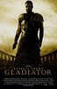
### 角斗士 / Gladiator / 帝国骄雄(港)  /  神鬼战士(台)
* 导演: Ridley Scott   主演: Russell Crowe / Joaquin Phoenix / Connie Nielsen
* 2000 / 英国 美国 / 剧情 动作 历史 冒险
* **8.4** 117517人评价

> 罗马斗兽场的鸦雀无声，久久停留在这样的肃穆中。

***

## Top 248

### 假如爱有天意 / 클래식 / 不可不信缘  /  缘起不灭
* 导演: 郭在容 Jae-young Kwak   主演: 孙艺珍 Ye-jin Son / 曹承佑 Seung-woo...
* 2003 / 韩国 / 剧情 爱情
* **8.2** 207825人评价

> 琼瑶阿姨在韩国的深刻版。

***

## Top 249

### 黑鹰坠落 / Black Hawk Down / 黑鹰降落  /  黑鹰计划
* 导演: 雷德利·斯科特 Ridley Scott   主演: 乔什·哈奈特 Josh Hartnett / ...
* 2001 / 美国 / 动作 历史 战争
* **8.5** 96430人评价

> 还原真实而残酷的战争。

***

## Top 250

### 导盲犬小Q / クイール / 再见了！可鲁  /  Quill
* 导演: 崔洋一 Yoichi Sai   主演: 小林薰 / 椎名桔平 / 香川照之
* 2004 / 日本 / 剧情
* **8.4** 110479人评价

> 宠物的意义在于化解人的孤独。

***

